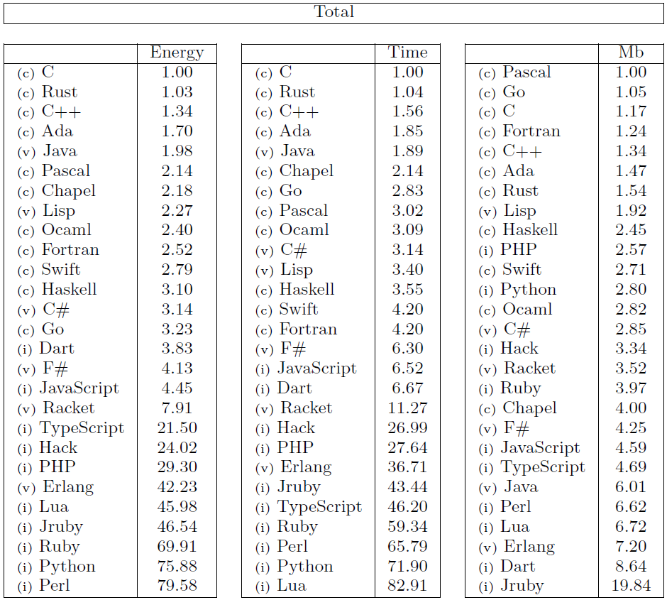

# AI Python-to-C Translator

*This project has been created by [3ka1tz](https://github.com/3ka1tz).*

## Description

This project aims to leverage the well-known performance benefits of the C language without sacrificing the ease and convenience of Python programming. To achieve this, I am developing an AI-powered, leak-free Python-to-C translator.

As Python's popularity continues to grow, many organizations face trade-offs in execution speed and computational efficiency. The relevance of this trade-off is highlighted in a comprehensive study by researchers at the Universidade do Minho in Portugal, which evaluates energy, speed, and memory efficiency across popular programming languages:

As the data demonstrates, the efficiency gap between C and Python is substantial, with C consistently ranking as the top-tier option. This project bridges that gap, helping organizations reduce operational costs and minimize environmental emissions.

## Instructions

## Resources

- [Cython Documentation](https://cython.readthedocs.io/en/latest)
- [Energy Efficiency across Programming Languages](https://sites.google.com/view/energy-efficiency-languages/home)
- [Ollama Documentation](https://docs.ollama.com)
- [Qwen Models for Ollama](https://ollama.com/library/qwen)
